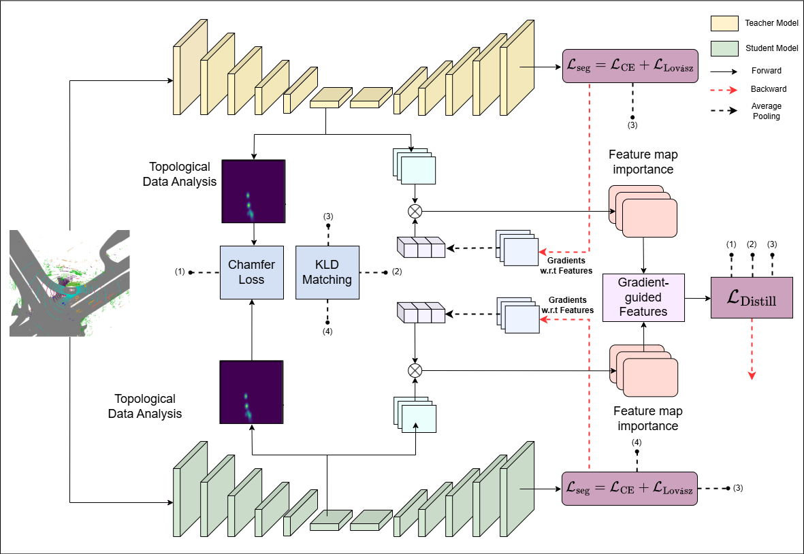

# Topology-Guided Knowledge Distillation for Efficient Point Cloud Processing

This repository is the official implementation of [Topology-Guided Knowledge Distillation for Efficient Point Cloud Processing](https://arxiv.org/abs/2030.12345)

<div align='middle'>

</div>

## Requirements

To install requirements:

```setup
conda create -n distillation python=3.8 -y
conda activate distillation
pip install torch==2.1.1 torchvision==0.16.1 torchaudio==2.1.1 --index-url https://download.pytorch.org/whl/cu118

# HPC set up
module purge
module load shared rc-base CUDA/11.8.0
module load shared rc-base cuDNN/8.9.2.26-CUDA-11.8.0

# To install packages, load gcc 8.2.0
module load GCC/8.2.0  # or GCC/8.2.0-2.31.1

conda install ninja -y

# Download pointops from poincept
cd libs/pointops
python setup.py install
cd ../..

pip install spconv-cu118
pip install torch-scatter -f https://data.pyg.org/whl/torch-2.1.0+cu118.html
pip install torch-sparse -f https://data.pyg.org/whl/torch-2.1.0+cu118.html
pip install nuscenes-devkit

conda install sharedarray tensorboard tensorboardx yapf addict einops scipy plyfile termcolor timm -c conda-forge -y
pip install torch-cluster -f https://data.pyg.org/whl/torch-2.1.0+cu118.html
pip install torch-scatter torch-sparse -f https://data.pyg.org/whl/torch-2.1.0+cu118.html

pip install torch-geometric

# load gcc/11.2.0 first to install pytorch3d
module load GCC/11.2.0  
pip install "git+https://github.com/facebookresearch/pytorch3d.git@stable"
pip install flash-attn --no-build-isolation
```

To run experiments after installation:

```run experiments
module load shared rc-base CUDA/11.8.0
module load shared rc-base cuDNN/8.9.2.26-CUDA-11.8.0
module load GCC/11.2.0
```

## Data Preparation

### SemanticKITTI
- Download [SemanticKITTI](http://www.semantic-kitti.org/dataset.html#download) dataset.
- Link dataset to codebase.
```bash
# SEMANTIC_KITTI_DIR: the directory of SemanticKITTI dataset.
# |- SEMANTIC_KITTI_DIR
#   |- dataset
#     |- sequences
#       |- 00
#       |- 01
#       |- ...
```

### nuScenes
- Download the official [NuScene](https://www.nuscenes.org/nuscenes#download) dataset (with Lidar Segmentation) and organize the downloaded files as follows:
```bash
NUSCENES_DIR
#│── samples
#│── sweeps
#│── lidarseg
#...
#│── v1.0-trainval 
#│── v1.0-test
```

- Run information preprocessing code for nuScenes as follows:
```bash
# NUSCENES_DIR: the directory of downloaded nuScenes dataset.
# PROCESSED_NUSCENES_DIR: the directory of processed nuScenes dataset (output dir).
# MAX_SWEEPS: Max number of sweeps. Default: 10.
python pointcept/datasets/preprocessing/nuscenes/preprocess_nuscenes_info.py --dataset_root ${NUSCENES_DIR} --output_root ${PROCESSED_NUSCENES_DIR} --max_sweeps ${MAX_SWEEPS} --with_camera
```

- Link raw dataset to processed NuScene dataset folder:

```bash
# NUSCENES_DIR: the directory of downloaded nuScenes dataset.
# PROCESSED_NUSCENES_DIR: the directory of processed nuScenes dataset (output dir).
ln -s ${NUSCENES_DIR} {PROCESSED_NUSCENES_DIR}/raw
```

then the processed nuscenes folder is organized as follows:

```bash
nuscene
#|── raw
#    │── samples
#    │── sweeps
#    │── lidarseg
#    ...
#    │── v1.0-trainval
#    │── v1.0-test
#|── info
```

### Waymo
- Download the official [Waymo](https://waymo.com/open/download/) dataset (v1.3.2 ~ v1.4.2) and organize the downloaded files as follows:
```bash
WAYMO_RAW_DIR
#│── training
#│── validation
#│── testing
```

- Install the following dependence:
```bash
# If shows "No matching distribution found", download whl directly from Pypi and install the package.
pip install waymo-open-dataset-tf-2-11-0
```

- Run information preprocessing code as follows, the preprocessing code turns the raw Waymo dataset to a SemanticKITTI style:
```bash
# WAYMO_DIR: the directory of downloaded waymo dataset.
# PROCESSED_WAYMO_DIR: the directory of processed waymo dataset (output dir).
# NUM_WORKERS: num workers for preprocessing
python pointcept/datasets/preprocessing/waymo/preprocess_waymo.py --dataset_root ${WAYMO_DIR} --output_root ${PROCESSED_WAYMO_DIR} --splits training validation --num_workers ${NUM_WORKERS}
```

### Config files
- Each dataset has its own config file in folder configs. Set the correct paths to your stored dataset
```bash
save_path
miou_result_path
data_root
```
## Training

To train the model(s) in the paper, run this command:

```train
python train.py 
```

## Evaluation

To evaluate my model on NuScenes, run:

```eval
python eval.py --model-file mymodel.pth --benchmark nuscenes
```

## Results

Our topology-guided knowledge distillation framework achieves state-of-the-art performance for efficient point cloud processing, balancing high accuracy with significant resource savings. The table below highlights key results on the NuScenes, SemanticKITTI, and Waymo datasets, comparing our student model to the teacher (Point Transformer V3) and other efficient baselines.

| Model                     | Parameters (M) | FPS (NuScenes) | CUDA Memory (GB) | mIoU (NuScenes) | mIoU (SemanticKITTI) | mIoU (Waymo) |
|---------------------------|----------------|----------------|------------------|-----------------|----------------------|---------------|
| PTv3 (Teacher)            | 46.16          | 16.61          | 16.05            | 80.03           | 75.5                 | 71.3          |
| Our Student (Full KD)     | **2.78**       | **27.64**      | **3.57**         | **78.1**        | **74.6**             | **69.5**      |

**Key Highlights**:
- **Efficiency**: The student model is **16.6× smaller** (2.78M vs. 46.16M parameters), uses **4.5× less memory** (3.57 GB vs. 16.05 GB), and achieves a **1.64× faster inference speed** (27.64 FPS vs. 16.61 FPS) compared to the teacher on NuScenes (Tables 5, 6).
- **Performance**: On NuScenes, our student model achieves **78.1% mIoU**, surpassing prior LiDAR-only knowledge distillation methods (e.g., 68.6% for VueNet3D [55]) and competing with efficient baselines like SPVNAS (Table 4).
- **Ablation**: The full distillation framework (ℒ_topo + ℒ_grad + ℒ_KLD + ℒ_seg) improves mIoU by **+4.1%** on NuScenes compared to the baseline (ℒ_KLD + ℒ_seg, 74.0% mIoU), demonstrating the value of topology-aware and gradient-guided losses (Table 7).
- **Visualization**: The student model produces clean boundaries and consistent predictions, closely matching the teacher and ground truth on NuScenes (Figure 4).
- **Note**: The teacher model (Point Transformer V3) was trained from scratch, as pre-trained weights were not released by the authors at the time of this project, ensuring a fair and reproducible evaluation.
